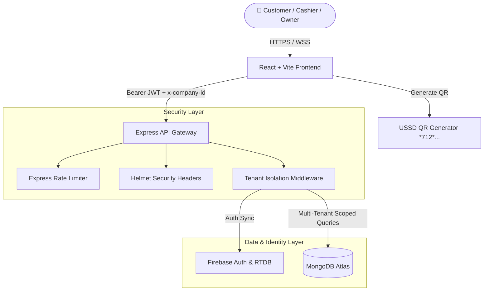

<div align="center">

  # 💎 Gurey Group — Enterprise Multi-Tenant SaaS Platform

  <p align="center">
    <strong>A State-of-the-Art Liquid Glassmorphism POS, Inventory Management & Financial Analytics Suite</strong>
  </p>

  <p align="center">
    <a href="#-key-features">Features</a> •
    <a href="#-tech-stack">Tech Stack</a> •
    <a href="#-responsive-design--micro-animations">Design & UI</a> •
    <a href="#-getting-started">Getting Started</a> •
    <a href="#-architecture">Architecture</a> •
    <a href="#-security--hardening">Security</a>
  </p>

  <div>
    
    
    
    
    
    
  </div>

  <br />
</div>

---

## 🌟 Overview

**Gurey Group** is a next-generation enterprise multi-tenant SaaS application built for modern businesses, retail chains, and luxury boutiques. Designed with a **Liquid Glassmorphism UI**, micro-animations, and fluid responsive layouts, it provides complete store management—from high-velocity Point-of-Sale (POS) transactions and mobile money USSD payments to role-based access control (RBAC), live multi-warehouse inventory, and thermal receipt streaming.

---

## ✨ Key Features

### 🛒 High-Speed Point-of-Sale (POS) & Mobile Money QR
- **Barcode & SKU Scanning**: Instant product lookup with fast auto-cart add.
- **📱 USSD Mobile Money QR**: Dynamic QR code generation for mobile payment services (**EVC Plus**, **Zaad**, **Sahal**). Encodes `*712*{merchantNumber}*{amount}#` with instant 1-tap phone dialer launch.
- **Cart Management**: Hold & resume cart states, preset discount buttons (5%, 10%, 15%), cash change due calculator.
- **Thermal Receipts & Tax Invoices**: Generate printable thermal receipts (`REC-XXXXXX`) and commercial tax invoices.

### 🏢 Multi-Tenant Architecture
- **Automatic Workspace Scoping**: `1 Workspace = 1 Organization`. Seamless tenant isolation backed by custom `x-company-id` header binding and JWT tenancy scope.
- **Multi-Branch Operations**: Assign employees, stock levels, and audit logs to specific store branches.

### 🔐 Enterprise Security & RBAC
- **Granular Permissions**: Role-based access hierarchy supporting `Owner`, `Admin`, `Manager`, and `Cashier`.
- **Zero-Trust Backend**: Protected by JWT verification, Helmet security headers, rate limiting (300 req/15min), and strict CORS origin checks.
- **Environment Isolation**: Zero hardcoded secrets—all credentials managed via secure environment variables.

### 📦 Inventory & Warehouse Control
- **Real-Time Stock Auditing**: Live stock counts, low-stock threshold alerts, batch expiry tracking, and stock adjustment logs.
- **Multi-Warehouse Allocation**: Track movement across multiple fulfillment centers.

### 👥 Team & Employee Management
- **Instant Employee Invitations**: Secure tokenized invite links (`/invite/:token`) with automatic client-side offline resiliency when backend services undergo maintenance.
- **Attendance & Audit Logs**: Detailed event streaming for logins, transaction refunds, stock adjustments, and profile updates.

---

## 🎨 Responsive Design & Micro-Animations

Gurey Group is engineered to look stunning on all display viewports—from **320px mobile devices to 4K ultra-wide monitors**.

```
📱 Mobile (320px - 640px)   ➔ Full-width drawer navigation + responsive scrollable tables
📐 Tablet (768px - 1024px)  ➔ Collapsible sidebar + adaptive grid matrix
💻 Desktop (1280px - 4K)    ➔ Fixed glass navigation + multi-column executive analytics
```

### ⚡ Micro-Animation System
- **`glass-panel`**: Multi-layered backdrop blur (`backdrop-filter: blur(20px)`) with neumorphic highlights.
- **`page-enter`**: Smooth 350ms cubic-bezier slide-up page transitions.
- **`skeleton`**: Shimmering animated loaders for seamless content fetching states.
- **`btn-micro`**: Tactile micro-scaling click responses (`scale-[1.02]` / `scale-[0.98]`).
- **`qr-modal-card`**: Dynamic modal entrance with smooth backdrop blur overlay.

---

## 🏗️ System Architecture



---

## 🛠️ Tech Stack

| Domain | Technology | Description |
| :--- | :--- | :--- |
| **Frontend Framework** | React 18.3 | Modern functional component architecture with hooks |
| **Styling & Design** | Tailwind CSS 3.4 | Glassmorphism, custom mesh gradients & animations |
| **Icons** | Lucide React | Clean, modern vector icon suite |
| **QR Code Engine** | `qrcode.react` | High-precision SVG QR code rendering |
| **Backend Runtime** | Node.js + Express 4 | Modular API endpoints with tenant middleware |
| **Database** | MongoDB Atlas | Mongoose ODM with tenant-isolated collections |
| **Authentication** | Firebase Auth | Google OAuth 2.0 & Email/Password session state |
| **Security** | Helmet, Rate-Limit, JWT | Complete API protection suite |

---

## 🚀 Getting Started

### Prerequisites
- **Node.js**: `v18.x` or higher
- **npm**: `v9.x` or higher
- **MongoDB Atlas** database URI
- **Firebase** Web project config

### 1. Clone Repository
```bash
git clone https://github.com/uncannystranger/gureygroup.git
cd gureygroup
```

### 2. Configure Environment Variables
Copy `.env.example` to create your local `.env` file:
```bash
cp .env.example .env
```

Fill in your database and Firebase keys in `.env`:
```env
# Database
MONGODB_URI=mongodb+srv://<user>:<password>@<cluster>.mongodb.net/?appName=gureygroup

# JWT Secrets
JWT_SECRET=your_super_secret_64_char_hex_key
JWT_REFRESH_SECRET=your_super_secret_refresh_key

# Firebase SDK
VITE_FIREBASE_API_KEY=AIzaSy...
VITE_FIREBASE_AUTH_DOMAIN=your-app.firebaseapp.com
VITE_FIREBASE_PROJECT_ID=your-app-id
```

### 3. Install Dependencies
```bash
# Install frontend dependencies
npm install

# Install backend dependencies
cd backend && npm install && cd ..
```

### 4. Run Development Servers
```bash
# Terminal 1: Start Backend API (Port 5000)
cd backend
npm run dev

# Terminal 2: Start Frontend Application (Port 5173)
npm run dev
```

Open [http://localhost:5173](http://localhost:5173) in your browser.

---

## 🛡️ Security & Hardening

Gurey Group follows **Zero-Trust Security Principles**:
- 🔒 **No Hardcoded Secrets**: Secrets are purged from source control and loaded runtime via `.env`.
- 🔐 **Tenant Isolation**: Every database operation verifies the tenant ID (`req.tenantId`) parsed from cryptographically signed JWT tokens.
- 🛡️ **Defensive Error Middleware**: Production API error responses suppress stack traces to prevent info leaks.
- 🚫 **Secret Scanning Compliant**: Environment key patterns are strictly ignored via `.gitignore`.

---

## 📜 License

Distributed under the **MIT License**. See `LICENSE` for more information.

---

<div align="center">
  <sub>Built with ❤️ by the <strong>Gurey Group Engineering Team</strong></sub>
</div>
