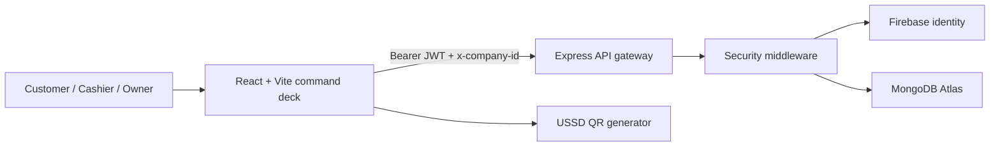

<div align="center">

  

  # ◈ GUREY GROUP // OPERATING SYSTEM FOR MODERN COMMERCE

  <p>
    
  </p>

  <p>
    <a href="#-system-capabilities">CAPABILITIES</a> ·
    <a href="#-interface-protocol">INTERFACE</a> ·
    <a href="#-architecture-grid">ARCHITECTURE</a> ·
    <a href="#-launch-sequence">LAUNCH</a>
  </p>

  <p>
    
    
    
    
  </p>

  <sub>Made with 🧡 by <strong>uncannystranger</strong></sub>
</div>

<br />

> **/// SYSTEM BRIEF**
> Gurey Group is a multi-tenant SaaS command layer for retail teams: fast POS operations, live inventory, branch control, financial reporting, and secure collaboration in one responsive workspace.

<div align="center">

`[ SIGNAL: LIQUID GLASS ]`　`[ MOTION: ENABLED ]`　`[ TENANCY: ISOLATED ]`　`[ ACCESS: RBAC ]`

</div>

## ◈ System Capabilities

| Module | Runtime behavior |
| --- | --- |
| **POS / Checkout** | Barcode and SKU lookup, held carts, discounts, change calculation, thermal receipts, tax invoices, and mobile-money QR flows for EVC Plus, Zaad, and Sahal. |
| **Inventory Grid** | Stock thresholds, batch expiry tracking, adjustments, SKU management, and multi-warehouse allocation. |
| **Tenant Core** | Organization-scoped data, branch assignment, tenant headers, and JWT tenancy binding. |
| **People + Access** | Owner, Admin, Manager, and Cashier roles with granular permissions, invitations, attendance, sessions, and audit trails. |
| **AI Operations** | Workspace-aware assistant surfaces and monthly reporting workflows. |

## ⟡ Interface Protocol

The interface is styled like a calm cyberpunk control deck: luminous signals, translucent surfaces, and feedback that arrives in milliseconds.

```text
┌──────────────────────────────────────────────────────────────┐
│  GUREY GROUP // COMMAND DECK                                 │
│  ────────────────────────────────────────────────────────────  │
│  [01] GLASS PANELS      depth without visual noise            │
│  [02] SIGNAL MOTION     350ms route transitions               │
│  [03] TACTILE INPUT     hover, press, focus, confirmation     │
│  [04] RESPONSIVE GRID   320px mobile → 4K desktop             │
└──────────────────────────────────────────────────────────────┘
```

### Motion language

- **Page transitions:** compact fade-and-rise movement keeps route changes legible.
- **Micro-interactions:** controls use subtle scale, glow, and color feedback.
- **Living surfaces:** glass panels, mesh gradients, shimmer loaders, and floating assistant states create depth.
- **Responsive continuity:** mobile drawers and desktop navigation share the same interaction vocabulary.

## ⌁ Architecture Grid



### Stack

| Layer | Technology |
| --- | --- |
| Frontend | React 18.3, Vite, Tailwind CSS, Lucide React |
| API | Node.js, Express 4, Mongoose |
| Data | MongoDB Atlas with tenant-isolated collections |
| Identity | Firebase Auth and RTDB |
| Security | JWT, Helmet, rate limiting, strict CORS |
| Payments | `qrcode.react` with mobile-money USSD payloads |

## 🚀 Launch Sequence

### Requirements

- Node.js `18.x` or newer
- npm `9.x` or newer
- MongoDB Atlas URI
- Firebase Web project configuration

### 1. Clone and configure

```bash
git clone https://github.com/uncannystranger/gureygroup.git
cd gureygroup
cp .env.example .env
```

Fill `.env` locally with your MongoDB, JWT, and Firebase values. Never commit `.env`.

### 2. Install dependencies

```bash
npm install
cd backend && npm install && cd ..
```

### 3. Start the local grid

```bash
# Terminal 1 — API server (default: http://127.0.0.1:5050)
cd backend && npm run dev

# Terminal 2 — Vite frontend (default: http://127.0.0.1:3000)
npm run dev:frontend
```

The root `npm run dev` command starts both processes together.

## 🛡 Security Signal

- Secrets load from environment variables and are excluded by `.gitignore`.
- JWT verification and tenant binding protect organization-scoped API access.
- Helmet, rate limiting, strict CORS, and defensive error responses harden the API edge.
- Backend migrations run during startup against the configured database.

## ◇ Project Status

This repository is the active Gurey Group SaaS workspace. Build the frontend with:

```bash
npm run build
```

<div align="center">

  <br />
  <sub>Made with 🧡 by <strong>uncannystranger</strong></sub>

</div>
